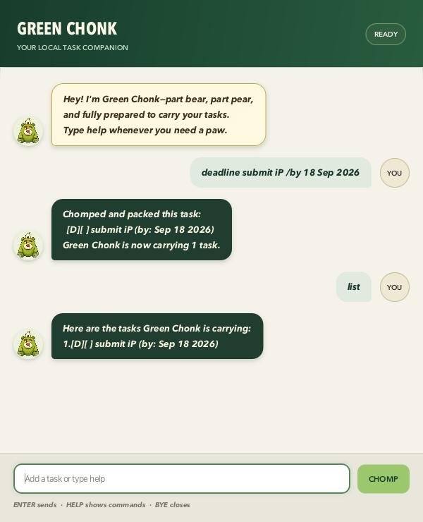

# Green Chonk User Guide

Green Chonk is a friendly, local task companion for people who want to manage
todos, deadlines, and events without leaving the keyboard. Its focused chat
interface keeps the commands visible, gives specific corrections when input is
invalid, and saves every successful change between sessions.



## Quick start

1. Install [Java 25](https://www.azul.com/downloads/?version=java-25-lts&package=jdk-fx).
2. Download `greenchonk.jar` from the
   [latest release](https://github.com/lzc-nus/ip/releases/latest).
3. Put the JAR in the folder where you want Green Chonk to keep its data.
4. Open a terminal in that folder and run:

   ```bash
   java --enable-native-access=javafx.graphics -jar greenchonk.jar
   ```

5. Type `help` in the command box whenever you need a reminder.

Green Chonk creates `data/greenchonk.txt` in the folder you run it from. Keep
that file if you move the app and want to retain your tasks.

> **Command conventions:** command words are case-insensitive, and harmless
> leading, trailing, or repeated whitespace is accepted. Text written in
> `UPPER_CASE` below is a value that you replace; do not type the underscores.

## Command summary

| Goal | Command |
|---|---|
| Add a todo | `todo DESCRIPTION` |
| Add a deadline | `deadline DESCRIPTION /by DATE` |
| Add an event | `event DESCRIPTION /from START_DATE /to END_DATE` |
| View every task | `list` |
| Find tasks by description | `find KEYWORD` |
| View tasks on a date | `schedule DATE` |
| Edit a task | `edit TASK_NUMBER /FIELD NEW_VALUE` |
| Mark a task done | `mark TASK_NUMBER` |
| Mark a task not done | `unmark TASK_NUMBER` |
| Delete a task | `delete TASK_NUMBER` |
| Show command help | `help` |
| Exit | `bye` |

## Understanding the task display

Each task starts with two icons:

- `[T]`, `[D]`, and `[E]` mean todo, deadline, and event respectively.
- `[ ]` means not done; `[X]` means done.

For example, `[D][X] submit report (by: Sep 18 2026)` is a completed deadline.
Numbers such as `2.` are the task numbers used by `edit`, `mark`, `unmark`, and
`delete`.

## Adding tasks

### Adding a todo: `todo`

Use a todo for a task without a date.

```text
todo read chapter 6
```

Green Chonk adds `[T][ ] read chapter 6` and reports the new task count.

### Adding a deadline: `deadline`

Use a deadline for work due on one date.

```text
deadline submit iP /by 18 Sep 2026
```

The `/by` marker must appear exactly once and must be followed by a valid date.

### Adding an event: `event`

Use an event for something that occupies a date or date range.

```text
event reading week /from 21 Sep 2026 /to 25 Sep 2026
```

The `/from` marker must appear before `/to`, each marker may appear only once,
and the ending date cannot be before the starting date. Use the same date twice
for a one-day event.

### Supported date formats

Green Chonk accepts three formats:

| Format | Example |
|---|---|
| `yyyy-MM-dd` | `2026-09-18` |
| `d/M/yyyy` | `18/9/2026` |
| `d MMM yyyy` | `18 Sep 2026` |

Slash dates use **day/month/year**. English month names are case-insensitive.
Dates are displayed as `MMM dd yyyy`, for example `Sep 18 2026`.

## Viewing and finding tasks

### Viewing every task: `list`

```text
list
```

Tasks appear in their current order with their task numbers. If there are no
tasks, Green Chonk says so instead of showing an empty heading.

### Finding tasks: `find`

```text
find report
```

`find` performs a case-insensitive substring search on task descriptions. A
search for `book` matches both `Read Book` and `return book`. Results retain
their original task numbers, so you can act on them immediately.

### Viewing a day's schedule: `schedule`

```text
schedule 18/9/2026
```

This shows deadlines due on that date and events whose inclusive date range
contains it. Todos are excluded because they have no date. Results retain their
original task numbers.

## Updating tasks

### Marking and unmarking

```text
mark 2
unmark 2
```

`mark` changes task 2 to `[X]`; `unmark` changes it back to `[ ]`. Dates and
descriptions are preserved.

### Editing one detail

Use one of these forms:

```text
edit 1 /description read chapters 6 and 7
edit 2 /by 2026-09-19
edit 3 /from 20 Sep 2026
edit 3 /to 26 Sep 2026
```

The `/by` field applies only to deadlines. The `/from` and `/to` fields apply
only to events. Every edit preserves the task's type, completion status, and
all details that you did not name. Green Chonk shows the task before and after
the change so you can verify it.

### Deleting a task

```text
delete 2
```

Green Chonk shows the removed task and the number remaining. Later tasks are
renumbered automatically, so run `list` again before another numbered command
if you are unsure.

## Duplicate and invalid input protection

Green Chonk rejects an exact duplicate when its type and details match an
existing task, including when editing a task. Completion status does not make
a duplicate unique. A todo and a deadline may share a description because
they represent different task types.

An invalid command does not modify the task list. Green Chonk explains what is
wrong and usually includes a valid example. Common cases include:

| Problem | How to recover |
|---|---|
| Missing description | Add text after `todo`, or before the date marker. |
| Invalid date | Use one of the three supported formats and a real calendar date. |
| Repeated marker | Keep only one `/by`, `/from`, or `/to` marker. |
| Backwards event | Change `/to` so it is the same as or later than `/from`. |
| Invalid task number | Run `list`, then use one of the displayed numbers. |
| Unknown command | Type `help` and use one of the listed command words. |

## Saving and data recovery

Every successful add, edit, status change, and deletion is saved automatically
to `data/greenchonk.txt`. Green Chonk writes a complete temporary file first and
then replaces the old file, reducing the risk of a partial save.

Do not edit the data file while Green Chonk is running. If a stored line is
malformed, Green Chonk identifies its line number and refuses to overwrite the
file. To recover:

1. Close Green Chonk.
2. Make a backup copy of `data/greenchonk.txt`.
3. Correct or move the malformed file.
4. Restart Green Chonk.

Moving the file starts with an empty task list while preserving the original
for manual recovery.

## Exiting safely

```text
bye
```

Green Chonk displays its farewell and closes. Task-changing commands are saved
when they succeed, so no extra save command is required.

## Troubleshooting

**The app does not open.** Confirm that `java -version` reports Java 25 and run
the command from a terminal so any startup message remains visible.

**Java prints a native-access warning.** Include
`--enable-native-access=javafx.graphics` before `-jar`, exactly as shown in the
quick-start command.

**My tasks appear to be missing.** Green Chonk uses the folder from which it was
started. Run the JAR from the same folder as before, or move the corresponding
`data` folder beside it.

**A command works but looks different from the example.** Dates are normalized
to the friendly display format, and command capitalization is not preserved.
Your description text is retained.

## Acknowledgements

Green Chonk was developed for the NUS CS2103T individual project and builds on
the [SE-EDU Duke project template](https://github.com/se-edu/duke). It uses
[OpenJFX](https://openjfx.io/), [Gradle](https://gradle.org/),
[JUnit](https://junit.org/junit5/), [JaCoCo](https://www.jacoco.org/jacoco/),
and the [Gradle Shadow plugin](https://gradleup.com/shadow/).

The Green Chonk mascot was supplied by the project owner. Its
transparent-background derivative was produced with OpenAI's image-generation
tool while preserving the supplied character design.
